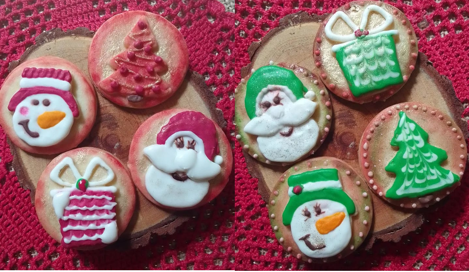

# site-biscoitos-decorados

Biscoitos Decorados
@biscoitos.gisa

<h1 id="titulo">Biscoitos Decorados em forma de arte!</h1>
 
O QUE SÃO BISCOITOS DECORADOS?
Os biscoitos decorados são os tradicionais biscoitos amanteigados com formatos divertidos e desenhos feitos com glacê real. 
São biscoitos que possuem uma massa caseira amanteigada e macia (aquele biscoito de vó)e , depois de assados, recebem uma cobertura.

[fotos]
<picture>
    <source media="(max-width: 750px)" srcset="imagens/duasfotos300p.png" type="image/png">
    <source media="(max-width: 1050px)" srcset="imagens/duasfotos600m.png" type="image/png">
    
</picture>

Informações iniciais

-Pedido mínimo de 06 biscoitos;
-Os biscoitos tem validade de 30 dias;
        Retiradas : Quintas e Sextas: das 12h às 19h30 e Sábados; das 09h as 15h;
-Os biscoitos são de ninho e chocolate com cobertura de glacê real;
-Quanto ao tamanho normalmente eles tem em média 8cm cada;
        Temporariamente, não estaremos trabalhando com formatos especiais, somente molduras/geométricos;
        Caso eu possua algum cortador no formato do tema, poderei utiliza-lo na composição do kit;
-São embaladinhos um a um, em saquinho transparente e fita de cetim combinando;
-Entregas no momento em terminais do Boa Vista - Cabral - Santa Candida;
-Os pedidos devem ser feitos com antecedência e conforme a disponibilidade na agenda;
        Trabalho somente com retiradas (R. Dr. Guedes Coelho nº 94 apto 31 - Encruzilhada / Santos-SP);
-Pode-se também utilizar serviços de retiradas (como uber flash), a solicitação no dia fica por conta do cliente;
-Não envio por correio (por serem delicados, acabam quebrando no caminho).

Biscoitos de Ninho:
Ingredientes: farinha de trigo, manteiga, açúcar de confeiteiro, ovo, leite condensado, leite ninho.
Biscoitos de Chocolate:
Ingredientes: farinha de trigo, manteiga, açúcar de confeiteiro, ovo, mel, cacau 50%, canela em pó, noz moscada, cravo em pó.

Biscoitos Simples – 4,50$
- Apenas com pó cintilante, e/ou iluminador prata ou dourado.

Biscoitos Elaborado - 6$
- Decorado com mais de uma camada de glacê.
- Diversos acabamentos como textura, relevo e escritas simples.

Embalagens opcionais:
- Temos opção de pacote transparente e laço - acréscimo de 1$ [FOTO]
- Temos opção de caixas com visor e laço - acréscimo de 4$ [FOTO]

Kit com 2 unidades [FOTO]
No pacote transparente:
- Simples - 10$
- Elaborado - 13$

Na caixa com visor:
- Simples – 13$
- Elaborado – 16$

Kit com 4 unidades [FOTO]
No pacote transparente:
- Simples - 19$
- Elaborado - 25$

Na caixa com visor:
- Simples - 22$
- Elaborado - 28$

Kit com 6 unidades [FOTO]
No pacote transparente:
- Simples - 28$
- Elaborado - 37$

Na caixa com visor:
- Simples - 31$
- Elaborado - 40$

E os modelinhos? Posso ver antes? Serão todos diferentes?

Não envio prévio nem rascunhos. O processo de criação é feito próximo à produção, e muitas vezes direto no biscoito. Por isso é muito importante as referências! É com elas que conseguirei unir o meu estilo combinando com a sua festa!

Quanto aos modelos do conjunto, me esforço para usar minha criatividade e fazê-los um diferente do outro, mas tudo depende do tema (alguns não temos muita referência, elementos para se trabalhar ou outros fatores), por isto também pedidos com mais de 06; Os biscoitos podem ocorrer de alguma repetição.

Sem pré-envios ou rascunhos. O processo de criação é próximo da produção e geralmente é feito diretamente no biscoito. É por isso que as referências são tão importantes! 

Quanto aos modelos do conjunto, procuro usar minha criatividade para diferenciá-los, mas tudo depende do tema (alguns não temos muita referência, elementos para trabalhar ou outros fatores), ou seja, por que são mais de 06. Pedidos também poderão ser duplicados.

Biscoitos no Palito
Os Biscoitos podem ser no palito, ideais para colocar no bolo, em cachepot e vasos na decoração, estes possuem um acréscimo de R$3,00 no valor unitário.

Giza, eu posso escolher ninho e chocolate no mesmo pedido?
Boa pergunta! Claro que podemos fazer assim :) 
Basta nos avisar certinho e com antecedência, para prepararmos com tempo e muito carinho.
Lembrando que o de ninho é um valor e o de chocolate é outro ;)

Biscoito de Colorir
Sucesso entre a criançada! O kit de biscoitos de colorir são ótimos para presentear, ser uma lembrancinha de festa e também para um escritório com a criança durante o aniversário! Todos os kits vão na caixinha e acompanham biscoito godê e um pincel para a brincadeira! Os desenhos são personalizados de acordo com o tema.

R$ 23,00

(pedido mínimo de 10 kits)
O kit de colorir é formado por: 01 biscoito com o desenho, 01 biscoito godê com as cores, 01 pincel, instruções. O kit vai em caixinha kraf com tampa transparente e palha colorida no fundo (núcleos conforme disponibilidade)

Os desenhos serão selecionados para cada 05 unidades. Por exemplo: 10 unidades - 02 desenhos, 15 unidades - 3 desenhos...

E os modelinhos? Posso ver antes? Serão todos diferentes?

Não envio prévio nem rascunhos . O processo de criação é feito próximo à produção, e muitas vezes direto no biscoito. Por isso é muito importante as referências! É com elas que conseguirei unir o meu estilo combinando com a sua festa!

Quanto aos modelos do conjunto, me esforço para usar minha criatividade e fazê-los um diferente do outro, mas tudo depende do tema (alguns não temos muita referência, elementos para se trabalhar ou outros fatores), por isto também pedidos com mais de 06 Os biscoitos podem ocorrer de alguma repetição.

O formato dos biscoitos é feito com biscoiteiras de ferro, da Biscoitos Heloise. Mas tambem com cortadores especiais. 

[fotos]

